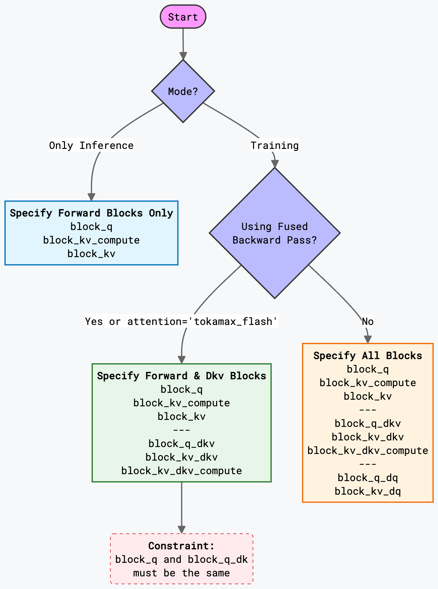

# Attention block sizes

## Description
- "block_q": Block sizes (HBM TO VMEM and VREG) to tile along Q sequence in forward pass
- "block_kv_compute" : Sub Block size (VMEM to VREG) of "block_kv" where compute is performed in forward pass. It must be factor or same as "block_kv"
- "block_kv" : Block sizes (HBM TO VMEM) to tile along KV sequence in forward pass
- "block_q_dkv" : Block sizes along Q sequence in backward pass with fused kernel to compute gradient of q, k , v. It must be factor or same as block_q 
- "block_kv_dkv" : Block sizes along KV sequence in backward pass. It must be factor or same as block_kv
- "block_kv_dkv_compute" : Sub Block Sizes of block_kv_dkv, must be factor or same as "block_kv_dkv"
- "block_q_dq" : Block sizes along Q sequence in backward pass with unfused kernel to compute gradient of just q. it must be factor or same as "block_q"
- "block_kv_dq" : Block sizes along KV to tiline on KV sequence in backward pass with unfused kernel to compute gradient of just q. it must be factor or same as "block_kv"
- "use_fused_bwd_kernel" : This means fused bwd kernel is used where DQ, DK, DV are computed in single kernel. It usually more perfomant but comes with slight HBM memory overhead.

## Flowchart

Maxdiffusion automatically adheres to this flowchart to ensure working, and there is a log that will inform you on the modifications that maxdiffusion makes to the specified block sizes. 

> "tokamax_flash" uses the splash attention implementation in [tokamax-repo](https://github.com/openxla/tokamax/blob/main/tokamax/_src/ops/experimental/tpu/splash_attention/splash_attention_kernel.py) This kernel only supports fused backward pass where gradients for q,k,v are computed in a single kernel so "block_q_dq" and "block_kv_dq" are not used

## How block sizes matter for perfomance and accuracy

Block sizes key to saturating HBM bandwidth and ensuring maximum possible overlap of computation on cores with HBM use and VMEM to VREG. It is highly recommended to tune them. 

Block sizes also have an effect on the sequence length. Sequence length is multiple of resolution and number of frames (video), along with VAE scale down factors and patchifying ratios. This sequence length or shard of this sequence length needs to be multiple of the block sizes specified. Therefore maxdiffusion pads the sequence lengths to the nearest multiple of the block sizes. It is advisable to choose block sizes which are factor of sequence length, atleast for the Q block sizes.

> In cross attention Image or Video tokens are attending to text tokens sequence length of text tokens is really small and potentially smaller than specified block size so KV block sizes are overwritten to safe values.

> KV block sizes must be multiple of 128 since the size of register is 8x128 and in attention KV sequence dim lies on 128 for the multiplications as K is transposed.