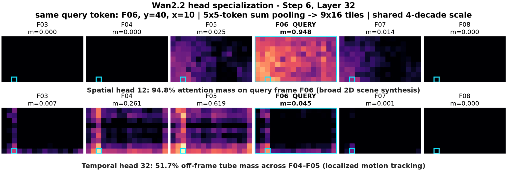
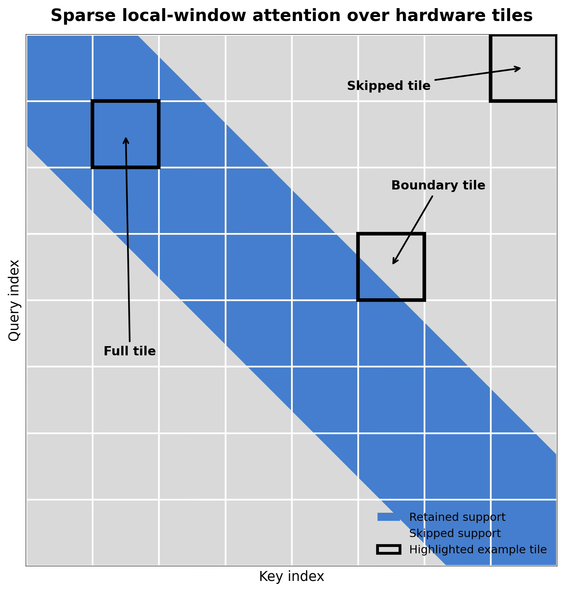

# Sparse VideoGen attention on TPUs

Video diffusion models generate a video through a sequence of denoising steps. At each step, attention lets each video token gather information from other tokens across space and time. This becomes expensive as the resolution and number of frames grow: dense attention considers every query–key pair, even though many interactions contribute very little to the output.

Sparse spatiotemporal attention takes advantage of this structure. Instead of attending everywhere, a query attends to a smaller set of positions chosen to capture the spatial and temporal information it needs.

## How SVG chooses where to attend

[Sparse VideoGen (SVG)](https://arxiv.org/abs/2502.01776) observes that attention heads often favor different patterns. Spatial heads concentrate attention within a frame or nearby frames. Temporal heads concentrate attention around corresponding spatial positions across frames. These patterns let us approximate dense attention while computing fewer interactions.



*Observed attention weights for the same query in two heads. The spatial head concentrates 94.8% of its attention on the query frame, while the temporal head places substantial attention near corresponding positions in other frames. Cyan squares mark the query's spatial position; `m` is the attention mass in each displayed frame. Colors use a shared logarithmic scale. These are examples of observed attention, rather than the masks themselves.*

SVG makes the choice separately for each head:

1. **Profile a few queries.** Compute dense attention outputs for a small sample of query tokens, using all keys.
2. **Compare two patterns.** Compute the sampled outputs under spatial and temporal masks, then measure each one's error relative to dense attention.
3. **Use the better approximation.** Select the lower-error pattern and apply sparse attention to all queries in that head.

The choice is recomputed at each active layer and denoising step. A head does not need to keep the same assignment throughout generation. Sparsity is configurable, so the same method can trade a smaller approximation error for a larger reduction in computation.

This implementation reimplements routing, token placement, and kernel execution for Wan and LTX2 in MaxDiffusion. The [original SVG implementation](https://github.com/svg-project/Sparse-VideoGen) provides the reference method.

## Making sparse attention efficient on TPU

Skipping query–key interactions only helps if the hardware can skip the corresponding work efficiently. Our implementation arranges tokens so that both spatial and temporal patterns can use the same local-band attention kernel. Spatial heads keep frame-major order; temporal heads group corresponding spatial positions across frames. Outputs are restored to their original order afterward.

TPUs compute attention in tiles. A tile can lie entirely inside the sparse pattern, entirely outside it, or cross its boundary.



*Sparse pattern before tile rounding. Query and key indices refer to the selected token layout. Blue indicates retained interactions and gray indicates skipped interactions. The prefix anchor is omitted for clarity.*

We round boundary tiles to either keep or skip them, approximately preserving the attention-pair budget of the original pattern. This slightly changes which interactions are retained, but lets all selected interior tiles run through one kernel without per-token sparse masking. Only tiles touching sequence padding need an additional validity mask; their outputs are combined with the main result using a numerically stable merge.

Token placement and restoration run after the Ulysses exchange, on each device's local heads. This limits the layout work to the heads that device will actually process.

The masks also include an optional prefix anchor. The `svg_include_first_frame` option retains the first `H × W` keys in the selected layout. For temporal heads, that prefix spans spatial positions across frames, so it does not correspond to the original first video frame.

## Configuration and usage

SVG is disabled by default. To enable it, set `use_svg_attention=True` and choose the densities and the steps and layers where sparsity should be active. Calls outside that interval continue to use dense attention.

For example, these overrides select the moderate Wan2.2 policy:

```yaml
use_svg_attention: True
svg_high_noise_density: 0.50
svg_low_noise_density: 0.20
svg_active_start_step: 11
svg_active_end_step: 40
svg_active_start_layer: 1
svg_active_end_layer: 40
svg_profile_query_count: 64
svg_sample_max_row: 10000
svg_profile_seed: 0
svg_include_first_frame: True
```

Step and layer intervals are zero-based and half-open: `[11, 40)` includes steps 11 through 39. Steps refer to denoising iterations, not noise-timestep values.

| Option | What it controls |
|---|---|
| `svg_spatial_density` | Density for single-expert Wan models; applies to either selected head pattern. |
| `svg_high_noise_density`, `svg_low_noise_density` | Separate densities for Wan2.2's two experts. |
| `svg_active_start_step`, `svg_active_end_step` | Denoising steps where SVG is enabled. |
| `svg_active_start_layer`, `svg_active_end_layer` | Transformer layers where SVG is enabled. |
| `svg_profile_query_count` | Number of queries sampled when choosing each head's pattern. |
| `svg_sample_max_row` | Limits query sampling to this prefix of the sequence. |
| `svg_profile_seed` | Seed for reproducible query sampling. |
| `svg_include_first_frame` | Enables the prefix anchor in the selected layout. |
| `svg_flash_block_sizes` | Sparse kernel tiling; an empty mapping uses `flash_block_sizes`. |

Density controls the local-band width. The anchor and tile rounding affect the actual number of retained interactions, so density is not itself the fraction of total transformer FLOPs retained.

The following is an example attention configuration for eight devices. Add it and the policy above to a Wan2.2 configuration used by `src/maxdiffusion/generate_wan.py`:

```yaml
attention: ulysses_ring_custom_fixed_m
ici_data_parallelism: 2
ici_context_parallelism: 4
ulysses_shards: 2
flash_block_sizes:
  block_q: 6400
  block_kv: 2048
  block_kv_compute: 2048
  block_kv_compute_in: 1024
  heads_per_tile: 1
  vmem_limit_bytes: 67108864
svg_flash_block_sizes:
  block_q: 3328
  block_kv: 2816
  block_kv_compute: 256
  block_kv_compute_in: 256
  heads_per_tile: 1
  vmem_limit_bytes: 67108864
```

Dense calls retain their configured ring split. SVG exchanges over the whole context axis, giving Ring2/Ulysses2 for dense calls and Ring1/Ulysses4 for sparse calls in this example. Tile sizes may need tuning for other shapes and devices.

### Supported configurations

SVG supports inference through the four custom Ulysses/ring attention backends. It requires matching self-attention QKV shapes, a matching video-token grid, and `heads_per_tile=1`. Heads and sequence length must divide evenly across the context shards, including any heads created by folding an unsharded batch.

Training, Animate, external attention masks, periodic support, and chunked Ulysses are unsupported. SVG also cannot be combined with CFG cache or MagCache.

## Performance and quality

At 720p, SVG offers a configurable tradeoff between denoising latency and similarity to dense generation. The following Wan2.2 results use TPU v6e-8, 81 frames, and 40 denoising steps. Times are medians of three warm runs against same-node optimized fixed-M dense controls, using one prompt and seed.

| Policy | Estimated total transformer FLOPs saved | Dense denoising | SVG denoising | Denoising speedup | PSNR (dB) |
|---|---:|---:|---:|---:|---:|
| Conservative | ≈27.2% | 153.46 s | 136.11 s | **1.13×** | **26.47** |
| Moderate | ≈32.2% | 153.37 s | 127.94 s | **1.20×** | **26.14** |
| Aggressive | ≈37.3% | 153.50 s | 119.86 s | **1.28×** | **24.80** |

*PSNR is measured against dense outputs using FFmpeg's aggregate YUV metric.*

In an earlier evaluation using the moderate SVG policy, Wan2.2 at 720p retained **98.1% of the dense baseline’s mean VBench dimension score** across a 31-prompt, 16-dimension screening subset.

## Qualitative example


*Dense attention (left) and SVG (right), shown at three video frames. The overall scene and subject arrangement remain similar, with visible differences in ground texture, background detail, and coat patterns.*

This illustration is separate from the benchmark measurements above.

## Tests and profiling

Run the SVG tests from the repository root:

```bash
python -m pytest -q \
  src/maxdiffusion/tests/wan/svg_attention_test.py \
  src/maxdiffusion/tests/wan/svg_balanced_rounding_test.py \
  src/maxdiffusion/tests/wan/svg_config_propagation_test.py \
  src/maxdiffusion/tests/wan/svg_head_local_test.py \
  src/maxdiffusion/tests/wan/wan_pipeline_signature_test.py \
  src/maxdiffusion/tests/ltx2/test_svg_config_propagation_ltx2.py \
  src/maxdiffusion/tests/ltx2/test_svg_attention_ltx2.py
```

The tests cover routing and layout, configuration propagation, schedules, sharding, unsupported configurations, and numerical agreement with attention references. Production-kernel tests cover sparse and density-one support, aligned and padded sequences, and natural and base-2 exponentials.

For CPU semantics checks, set `JAX_PLATFORMS=cpu` and `XLA_FLAGS=--xla_force_host_platform_device_count=8`. Run the suite separately on an eight-device TPU host to exercise the compiled kernels. Tests restricted to one platform are skipped on the other.

For profiling, enable `enable_jax_named_scopes=True` and capture a short warm denoising interval. Routing, placement, main attention, padding cleanup, merging, and restoration have named scopes, including `svg_route_profile`, `svg_layout_place`, `svg_union_main`, `svg_tail_cleanup`, `svg_lse_merge`, and `svg_layout_restore`. The `svg_kernel_c_tiles…` scope reports the fraction of physical tiles executed, which differs from attention-pair density and total transformer FLOP savings.
