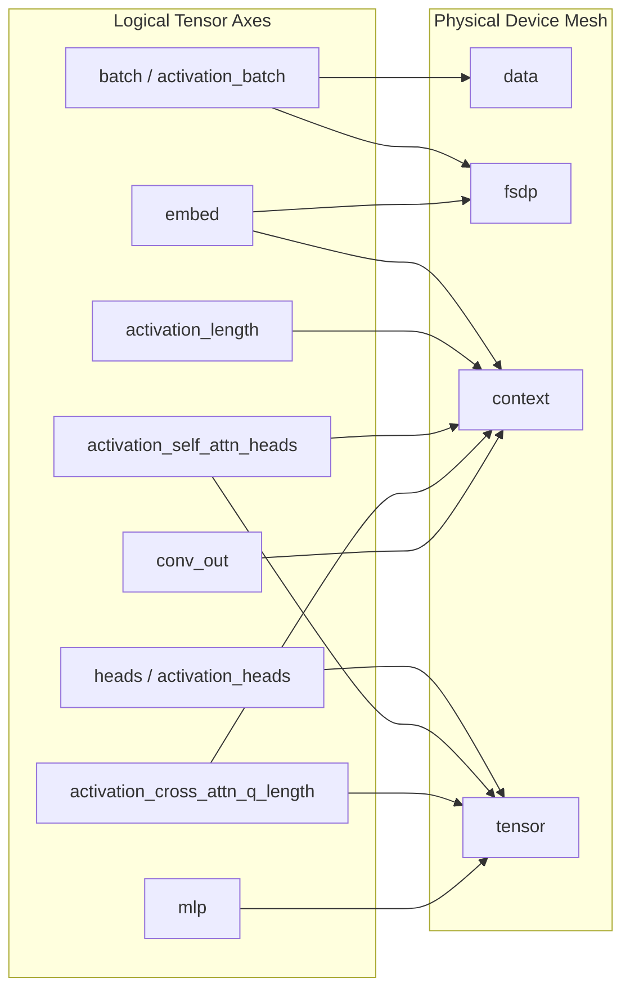
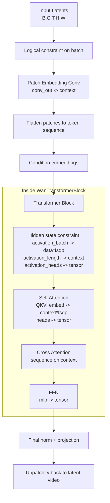
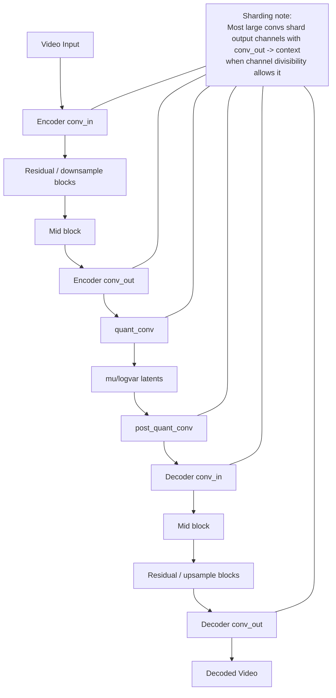

# WAN Sharding Report

## Scope

This report explains how WAN sharding works in this repository, with a focus on:

- what the mesh axes `data`, `fsdp`, `context`, and `tensor` mean in practice
- how logical tensor axes are mapped onto those mesh axes
- how the WAN transformer and WAN VAE are actually sharded
- where the current runtime-input sharding story is weaker than the model-parameter sharding story

The report is based on static inspection of the checked-out code.

## Executive Summary

WAN sharding in this repo is a two-stage system:

1. Build a 4D device mesh named `("data", "fsdp", "context", "tensor")`.
2. Give model tensors logical axis names like `batch`, `embed`, `heads`, `activation_length`, or `conv_out`, then map those logical names to mesh axes through `logical_axis_rules`.

The most important consequence is:

- `data`, `fsdp`, `context`, and `tensor` are mesh axes, not hard-wired algorithm names.
- The same mesh axis can mean different things for different tensors.

In the current WAN configs:

- `data` is the clearest batch/data-parallel axis.
- `tensor` is the clearest tensor-parallel axis and is heavily used for attention heads and MLP dimensions.
- `context` is the main sequence/context axis, but it is also reused for some conv output-channel sharding.
- `fsdp` is not acting like classic parameter-only FSDP. In practice it participates in batch and hidden-dimension sharding, so the name is more historical than literal.

The transformer has the strongest and most explicit sharding story:

- Q/K/V and output projections are annotated with logical axes.
- attention activations are explicitly constrained with `with_sharding_constraint`
- attention-internal sequence parallel rules can be strengthened at config init time

The VAE is different:

- most of its parameter sharding is driven by `WanCausalConv3d`
- large conv kernels are often sharded on their output-channel axis
- its activations are much less explicitly constrained than the transformer's
- its internal attention block is much simpler and does not use the WAN flash-attention path

There is also a runtime caveat:

- parameter sharding is much more complete than runtime batch/input sharding
- the repo includes a test describing a runtime fallback for undershardable batches, but that fallback is not implemented in `WanPipeline` today

## Core Terms

### Physical mesh axes

The WAN configs define a 4-axis mesh:

- `mesh_axes: ['data', 'fsdp', 'context', 'tensor']`

References:

- `src/maxdiffusion/configs/base_wan_14b.yml:154`
- `src/maxdiffusion/configs/base_wan_animate_27b.yml:144`

That mesh is created from the configured DCN/ICI parallelism factors in `create_device_mesh`, then wrapped as `Mesh(devices_array, config.mesh_axes)`.

References:

- `src/maxdiffusion/max_utils.py:258-311`
- `src/maxdiffusion/pipelines/wan/wan_pipeline.py:583-590`

### Logical tensor axes

The model code mostly does not shard directly by `data` or `tensor`. Instead it labels tensor dimensions with logical names such as:

- `batch`
- `activation_batch`
- `activation_length`
- `activation_heads`
- `activation_self_attn_heads`
- `activation_cross_attn_q_length`
- `embed`
- `heads`
- `mlp`
- `conv_out`

Then the config maps those logical names to physical mesh axes.

For WAN 2.1 / 2.2 configs, the default logical axis rules are:

| Logical axis | Mesh axis mapping |
| --- | --- |
| `batch` | `['data', 'fsdp']` |
| `activation_batch` | `['data', 'fsdp']` |
| `activation_self_attn_heads` | `['context', 'tensor']` |
| `activation_cross_attn_q_length` | `['context', 'tensor']` |
| `activation_length` | `context` |
| `activation_heads` | `tensor` |
| `mlp` | `tensor` |
| `embed` | `['context', 'fsdp']` |
| `heads` | `tensor` |
| `norm` | `tensor` |
| `conv_batch` | `['data', 'context', 'fsdp']` |
| `out_channels` | `tensor` |
| `conv_out` | `context` |

References:

- `src/maxdiffusion/configs/base_wan_14b.yml:168-182`
- `src/maxdiffusion/configs/base_wan_animate_27b.yml:158-172`

## What `data`, `fsdp`, `context`, and `tensor` mean here

### `data`

`data` is the clearest data-parallel axis.

It is used as part of:

- `batch -> ['data', 'fsdp']`
- `activation_batch -> ['data', 'fsdp']`

So when WAN constrains batch-like dimensions, `data` is one of the leading sharding axes.

Reference:

- `src/maxdiffusion/configs/base_wan_14b.yml:169-170`

### `tensor`

`tensor` is the clearest tensor-parallel axis in the repo.

It is used for:

- attention heads: `heads -> tensor`
- attention activation head dims: `activation_heads -> tensor`
- MLP expansion dims: `mlp -> tensor`
- norm scale parameters: `norm -> tensor`
- some conv activation channels: `out_channels -> tensor`

References:

- `src/maxdiffusion/configs/base_wan_14b.yml:174-180`

Operationally, this means `tensor` is the main head/MLP parallel axis.

### `context`

`context` is the main sequence/context axis in the current WAN stack.

It is used for:

- `activation_length -> context`
- sequence-parallel overrides for Q/K/V length axes in `pyconfig`
- `conv_out -> context`

So `context` is both:

- the main attention-sequence sharding axis
- a conv output-channel sharding axis in the VAE and patch embeddings

References:

- `src/maxdiffusion/configs/base_wan_14b.yml:171-173`
- `src/maxdiffusion/configs/base_wan_14b.yml:181`
- `src/maxdiffusion/pyconfig.py:203-227`

### `fsdp`

`fsdp` is the most overloaded name.

The README still describes WAN 2.1 as:

- `ici_fsdp_parallelism` is used for sequence parallelism
- `ici_tensor_parallelism` is used for head parallelism

Reference:

- `README.md:259-261`

But the current code and configs show that `fsdp` is not just a pure sequence-parallel or parameter-only axis:

- batch is sharded over `['data', 'fsdp']`
- `embed` is sharded over `['context', 'fsdp']`

References:

- `src/maxdiffusion/configs/base_wan_14b.yml:169-170`
- `src/maxdiffusion/configs/base_wan_14b.yml:176`

So in the current implementation, `fsdp` is best understood as:

- an extra model/batch parallel axis
- historically named `fsdp`
- not equivalent to classic PyTorch FSDP

## How sharding is applied at load time

Both WAN transformer and WAN VAE follow the same high-level pattern:

1. Instantiate an abstract model with `nnx.eval_shape`.
2. Extract logical partition specs from the state tree.
3. Convert logical specs to mesh shardings with `nn.logical_to_mesh_sharding(..., config.logical_axis_rules)`.
4. Load pretrained weights on CPU.
5. Place each parameter directly onto its target sharding.

References:

- Transformer: `src/maxdiffusion/pipelines/wan/wan_pipeline.py:95-177`
- VAE: `src/maxdiffusion/pipelines/wan/wan_pipeline.py:270-310`

This is why the logical axis rules matter so much: they are the bridge between model annotations and real device placement.

## Diagram: Mesh and Logical Axis Mapping

## Transformer Sharding

### Top-level structure

WAN transformer sharding is driven by a mix of:

- parameter annotations with `nnx.with_partitioning`
- activation constraints with `nn.with_logical_constraint`
- explicit `jax.lax.with_sharding_constraint` calls inside blocks

References:

- `src/maxdiffusion/models/wan/transformers/transformer_wan.py:435-688`
- `src/maxdiffusion/models/attention_flax.py:877-1252`

### Input activation constraint

At the model entrypoint, WAN constrains the input video latent tensor as:

- `hidden_states = nn.with_logical_constraint(hidden_states, ("batch", None, None, None, None))`

Reference:

- `src/maxdiffusion/models/wan/transformers/transformer_wan.py:598`

Because `batch -> ['data', 'fsdp']`, the batch dimension is intended to shard over `data*fsdp`.

### Patch embedding

The patch embedding conv is annotated on its output channel axis with `conv_out`:

- `kernel_init=... (None, None, None, None, "conv_out")`

Reference:

- `src/maxdiffusion/models/wan/transformers/transformer_wan.py:482-495`

Since `conv_out -> context`, patch embedding output channels are intended to shard over the `context` axis.

This is already a sign that `context` is not just “sequence length sharding”; it is also reused for model-width sharding in conv-like projections.

### Condition embedding and MLP projections

The timestep/text conditioning module uses:

- `time_proj`: `("embed", "mlp")`
- FFN in-projection: `("mlp", "embed")`
- FFN out-projection: `("embed", "mlp")`

References:

- `src/maxdiffusion/models/wan/transformers/transformer_wan.py:118-133`
- `src/maxdiffusion/models/wan/transformers/transformer_wan.py:185-201`
- `src/maxdiffusion/models/wan/transformers/transformer_wan.py:241-256`

Under the base WAN rules, that means:

- `embed` shards over `context*fsdp`
- `mlp` shards over `tensor`

So the hidden/model dimension is split across `context*fsdp`, while FFN expansion is split across `tensor`.

### Attention weight sharding

The WAN attention module uses:

- Q/K/V kernels: `("embed", "heads")`
- attention output kernel: `("heads", "embed")`
- RMSNorm scale: `("norm",)`

References:

- `src/maxdiffusion/models/attention_flax.py:954-1011`
- `src/maxdiffusion/models/attention_flax.py:1017-1039`

Mapped through the WAN logical rules, that means:

- `embed -> ['context', 'fsdp']`
- `heads -> tensor`
- `norm -> tensor`

So the dominant attention parameter layout is:

- hidden dimension split across `context*fsdp`
- head dimension split across `tensor`

### Attention activation sharding

Inside each `WanTransformerBlock`, WAN explicitly constrains the main activations:

- hidden states use `("activation_batch", "activation_length", "activation_heads")`
- encoder states use `("activation_batch", "activation_length", "activation_kv")`

References:

- `src/maxdiffusion/models/wan/transformers/transformer_wan.py:382-386`

Under the base rules this becomes:

| Activation axis | Effective mesh mapping |
| --- | --- |
| `activation_batch` | `data*fsdp` |
| `activation_length` | `context` |
| `activation_heads` | `tensor` |
| `activation_kv` | `tensor` |

This is the clearest expression of how WAN expects the core transformer to run:

- batch over `data*fsdp`
- sequence over `context`
- head / per-head channel work over `tensor`

### Attention kernel internal axes

`FlaxWanAttention` uses separate logical names for self-attention and cross-attention internals:

- self-attention Q/KV head axes
- self-attention Q/KV length axes
- cross-attention Q/KV head axes
- cross-attention Q/KV length axes

References:

- `src/maxdiffusion/models/attention_flax.py:924-950`
- `src/maxdiffusion/common_types.py:59-64`

There is an extra config-time override in `pyconfig`:

- if `attention == "ring"` or `attention_sharding_uniform == True`
- prepend sequence-parallel rules for `LENGTH`, `KV_LENGTH`, and the self/cross attention-specific q/kv length axes

References:

- `src/maxdiffusion/configs/base_wan_14b.yml:63-74`
- `src/maxdiffusion/pyconfig.py:203-227`

This matters because the YAML file alone does not tell the whole story. With default WAN settings:

- `attention: 'flash'`
- `attention_sharding_uniform: True`

the effective attention rules are more sequence-parallel than the raw config block suggests.

### WAN Animate transformer

WAN Animate uses the same `WanTransformerBlock` for its main transformer stack.

References:

- `src/maxdiffusion/models/wan/transformers/transformer_wan_animate.py:784-806`

So its main transformer sharding is fundamentally the same as base WAN.

Its extra modules differ:

- the small motion encoder is explicitly left without sharding annotations
- the face adapter uses simple `embed -> heads` and `heads -> embed` annotations
- patch embeddings again shard their output channels through `conv_out`

References:

- `src/maxdiffusion/models/wan/transformers/transformer_wan_animate.py:84-90`
- `src/maxdiffusion/models/wan/transformers/transformer_wan_animate.py:570-612`
- `src/maxdiffusion/models/wan/transformers/transformer_wan_animate.py:723-749`

### Transformer summary table

| Component | Annotation | Effective WAN mapping |
| --- | --- | --- |
| input batch | `("batch", ...)` | `data*fsdp` |
| patch embedding output channels | `conv_out` | `context` |
| Q/K/V kernel | `("embed", "heads")` | `embed -> context*fsdp`, `heads -> tensor` |
| attention output kernel | `("heads", "embed")` | `tensor -> context*fsdp` |
| FFN expansion | `mlp` | `tensor` |
| sequence activations | `activation_length` | `context` |
| head activations | `activation_heads` / `activation_kv` | `tensor` |

## Diagram: Transformer Dataflow

## VAE Sharding

### High-level difference from the transformer

The VAE uses the same load-time logical-to-mesh conversion path as the transformer, but its actual module-level sharding strategy is different:

- fewer explicit activation constraints
- heavier reliance on conv-kernel output-channel sharding
- simpler internal attention

References:

- `src/maxdiffusion/pipelines/wan/wan_pipeline.py:270-310`
- `src/maxdiffusion/models/wan/autoencoder_kl_wan.py:996-1104`

### VAE can be replicated

The VAE loader has an explicit escape hatch:

- if `config.replicate_vae` is true, each VAE parameter is forced to `NamedSharding(mesh, P())`

Reference:

- `src/maxdiffusion/pipelines/wan/wan_pipeline.py:301-305`

All WAN configs checked here default to:

- `replicate_vae: False`

Reference:

- `src/maxdiffusion/configs/base_wan_14b.yml:46`

### Core conv primitive: `WanCausalConv3d`

Most VAE sharding behavior comes from `WanCausalConv3d`.

The key logic is:

- inspect `mesh.shape["context"]`
- if `out_channels % num_context_axis_devices == 0`
- shard the kernel with `kernel_sharding = (None, None, None, None, "conv_out")`
- otherwise leave it unsharded

References:

- `src/maxdiffusion/models/wan/autoencoder_kl_wan.py:100-115`

Since `conv_out -> context`, this means:

- large VAE convs usually shard output channels across `context`
- but only when divisibility allows it
- otherwise they silently stay replicated on that dimension

This is an important practical detail: VAE conv sharding is conditional, not absolute.

### Where `WanCausalConv3d` is used

The following major VAE components use `WanCausalConv3d`:

- encoder `conv_in`
- encoder residual block convs
- encoder `conv_out`
- quantization conv
- post-quant conv
- decoder `conv_in`
- decoder residual block convs
- decoder `conv_out`
- temporal resample convs

References:

- encoder entry: `src/maxdiffusion/models/wan/autoencoder_kl_wan.py:687-697`
- encoder exit: `src/maxdiffusion/models/wan/autoencoder_kl_wan.py:750-760`
- residual blocks: `src/maxdiffusion/models/wan/autoencoder_kl_wan.py:404-437`
- resample temporal convs: `src/maxdiffusion/models/wan/autoencoder_kl_wan.py:293-334`
- quant/post-quant: `src/maxdiffusion/models/wan/autoencoder_kl_wan.py:1069-1089`
- decoder entry/exit: `src/maxdiffusion/models/wan/autoencoder_kl_wan.py:840-850`, `src/maxdiffusion/models/wan/autoencoder_kl_wan.py:899-909`

### Resample layers

The VAE's 2D upsample convs are annotated directly with:

- `(None, None, None, "conv_out")`

References:

- `src/maxdiffusion/models/wan/autoencoder_kl_wan.py:262-269`
- `src/maxdiffusion/models/wan/autoencoder_kl_wan.py:278-285`

So these layers also prefer output-channel sharding on `context`.

### VAE attention block

The VAE attention block is much simpler than WAN transformer attention.

It uses:

- a `to_qkv` 1x1 conv annotated with `conv_out`
- a `proj` 1x1 conv annotated with `conv_in`
- plain `jax.nn.dot_product_attention`

References:

- `src/maxdiffusion/models/wan/autoencoder_kl_wan.py:489-509`
- `src/maxdiffusion/models/wan/autoencoder_kl_wan.py:511-534`

This has a few implications:

1. It does not use `FlaxWanAttention`.
2. It does not use the WAN flash-attention machinery.
3. It does not impose the same detailed activation sharding constraints as the transformer.

There is also a noteworthy mismatch:

- the WAN configs define `conv_out`
- but they do not define a logical rule for `conv_in`

References:

- `src/maxdiffusion/configs/base_wan_14b.yml:168-182`
- `src/maxdiffusion/models/wan/autoencoder_kl_wan.py:500-505`

So the VAE attention output projection is annotated on `conv_in`, but under the current WAN config that logical axis does not appear to map to any mesh axis. In practice, that strongly suggests this part is effectively left unsharded.

### VAE activations

Compared with the transformer, the VAE does very little explicit activation layout enforcement.

What stands out in the VAE code:

- no `nn.with_logical_constraint` at model entry comparable to the WAN transformer's batch constraint
- no strong per-block `with_sharding_constraint` layout control for sequence/head-style axes
- more reliance on whatever placement falls out of parameter shardings and XLA propagation

References:

- transformer explicit constraints: `src/maxdiffusion/models/wan/transformers/transformer_wan.py:382-386`, `src/maxdiffusion/models/wan/transformers/transformer_wan.py:598`
- VAE encoder/decoder call paths: `src/maxdiffusion/models/wan/autoencoder_kl_wan.py:763-793`, `src/maxdiffusion/models/wan/autoencoder_kl_wan.py:911-945`

That is the biggest architectural difference between the WAN transformer and WAN VAE sharding stories.

### VAE summary table

| Component | Annotation / behavior | Effective WAN mapping |
| --- | --- | --- |
| main 3D convs | `conv_out` when divisible | output channels over `context` |
| 2D upsample convs | `conv_out` | output channels over `context` |
| VAE attention QKV | `conv_out` | output channels over `context` |
| VAE attention output proj | `conv_in` | no obvious WAN rule, likely not meaningfully sharded |
| VAE activations | mostly implicit | much looser than transformer |

## VAE Encode/Decode Path

## Runtime Input Sharding Caveat

Parameter sharding is reasonably explicit. Runtime input sharding is less complete.

There are three related signals:

1. `per_device_batch_size < 1` intentionally loads a larger batch than is actually trained on.
2. WAN training jit-compiles with fixed data shardings derived from `config.data_sharding`.
3. The repo contains a runtime-sharding fallback test for `WanPipeline`, but the helper methods referenced by the test are not implemented in the checked-out pipeline.

References:

- fractional batch sizing: `src/maxdiffusion/pyconfig.py:174-183`
- fixed train/eval data sharding: `src/maxdiffusion/trainers/wan_trainer.py:156-163`, `src/maxdiffusion/trainers/wan_trainer.py:357-366`
- missing runtime fallback helper test: `src/maxdiffusion/tests/wan_runtime_sharding_test.py:41-64`

There is also a more generic input-pipeline issue:

- multihost loading hard-codes `PartitionSpec(global_mesh.axis_names)` for input arrays

Reference:

- `src/maxdiffusion/multihost_dataloading.py:39-62`

So the current codebase is stronger at sharding model state than at adapting runtime inputs to undershardable batches.

## Practical Interpretation

If you are trying to reason about WAN runs in this repo, the most useful mental model is:

- `data`: batch parallelism
- `tensor`: head / MLP tensor parallelism
- `context`: sequence parallelism plus some conv output-channel sharding
- `fsdp`: an additional batch/model-width parallel axis with a legacy name

And then split the models like this:

- Transformer: carefully annotated and explicitly constrained
- VAE: mostly conv-output sharding on `context`, much lighter activation control

## Key Takeaways

1. Do not read `fsdp` literally as “classic FSDP” in WAN.
2. `tensor` is the clearest head/MLP tensor-parallel axis.
3. `context` is the main sequence axis, but it is also used for `conv_out`.
4. WAN transformer sharding is explicit and fine-grained.
5. WAN VAE sharding is primarily conv-driven and conditional on channel divisibility.
6. Runtime input sharding is still a weak point relative to parameter sharding.

